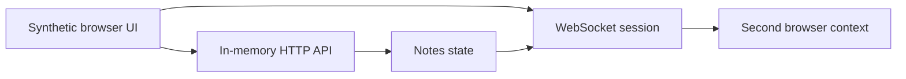

# LAN Device QA Showcase

[](https://github.com/luingry/xsharect-qa-showcase/actions/workflows/qa.yml)

An executable, sanitized QA automation case study for a private LAN Android product. Every executable asset in this repository is synthetic: the demo UI, server, access code, and test data. Physical acceptance appears only as a clearly labeled, self-reported sanitized summary. No product code, APK, device details, network addresses, credentials, customer data, or raw private evidence are included.

## Executive summary

This project demonstrates how I test a stateful device-and-browser experience: deterministic browser automation first, explicit physical-device boundaries second, and no “green” claim for scenarios that were not actually executed. The synthetic demo models authentication, a viewer shell, UTF-8 notes, WebSocket synchronization, reconnect feedback, and responsive controls.



## Why Playwright instead of Cypress?

Playwright is the better fit here because one test can create isolated browser contexts, observe two independent sessions, cover Chromium/Firefox/WebKit, and retain trace/video/screenshot evidence on failure. Cypress is a fine component-testing tool, but this case study emphasizes browser-to-device contracts, WebSocket state and multi-session synchronization.

## Test strategy

| Layer | Scope | Evidence |
|---|---|---|
| API contract | unauthorized requests, invalid JSON, CRUD status | deterministic Playwright request tests |
| Browser UI | auth, autosave, notes CRUD, reconnect, keyboard | web-first Playwright assertions |
| Cross-session | `notes_changed` synchronization | two isolated browser contexts |
| Responsive | 320, 390, 1440px containment | browser measurements |
| Physical/hybrid | projection, permissions, real transport | sanitized private-device acceptance summary |

See [test strategy](docs/TEST-STRATEGY.md), [test cases](docs/TEST-CASES.md), [traceability](docs/TRACEABILITY.md), and a [sanitized bug report](docs/BUG-REPORT-SAMPLE.md).

## Run locally

```bash
npm ci
npx playwright install
npm test
npm run test:critical
npm run test:cross-browser
npm run test:oracles
```

`npm test` starts the synthetic local server automatically. Reports are written to `playwright-report/` and JUnit XML to `test-results/junit.xml`; traces are captured on first retry and video/screenshots only on failure.

## Maestro and physical evidence

Reusable P0/P1 Maestro specifications are in [maestro/](maestro/README.md). They deliberately use `${APP_ID}` rather than a real application id. A sanitized summary records the acceptance executed against a private QA build on an owned physical Android device; raw APKs, logs, screenshots, identifiers, and network details are intentionally excluded.

See the [evidence summary](docs/RESULTS-SUMMARY.md) for the exact public-suite counts, private-device acceptance boundary, and exclusions.

P2 is explicitly excluded: multi-device discovery, battery/thermal measurement, extended soak tests, and OEM-specific behavior.

## Design decisions and trade-offs

- **Synthetic demo, explicit boundary.** The public suite executes a small, owned HTTP/WebSocket contract rather than claiming to exercise the private Android product. It makes the repository safe to share while preserving repeatable evidence for authentication, synchronization and recovery behavior. Physical outcomes are labelled as sanitized private acceptance, never as public-suite output.
- **Reset state and unique data.** Every browser test resets the demo state through a test-only endpoint, and cross-session tests use isolated contexts plus cleanup in `finally`. That removes order dependence while keeping the synchronization path real inside the synthetic stack.
- **Observable failure, not only happy paths.** Invalid authentication must leave the app shell locked; responsive checks measure clipping and minimum control size; unexpected runtime console and page errors fail the test. The suite checks what a user can observe rather than implementation-only flags.
- **Controlled mutation smoke.** `npm run test:oracles` deliberately sabotages authentication, note broadcast and disconnect behavior. It succeeds only when the corresponding test fails, providing a lightweight guard against assertions that can stay green after a meaningful regression.
- **Fast browser gate plus device runbook.** Playwright gives rapid multi-browser feedback and artifacts. MediaProjection, encoder behavior, OEM settings and real transport remain device-bound checks because replacing them with a browser mock would overstate coverage.

## Security and contribution

Read [SECURITY.md](SECURITY.md), [CONTRIBUTING.md](CONTRIBUTING.md), [CODE_OF_CONDUCT.md](CODE_OF_CONDUCT.md), and [LICENSE](LICENSE).
