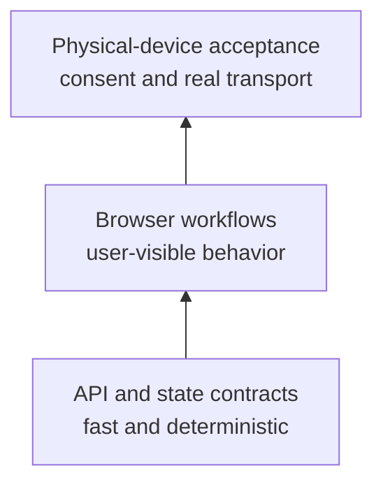

# Test strategy

## Quality risks

The highest risks are authorization bypass, stale synchronized state, UTF-8 data loss, reconnect ambiguity, and mobile layout overflow. The test suite converts each into a deterministic contract where possible.

The bottom layers run in CI. The top layer requires a real device, deliberate consent and observable evidence, so it remains a runbook rather than a fabricated pass.

## Design principles

1. Use an in-memory loopback server to avoid credentials, devices and network dependencies.
2. Assert visible behavior before implementation details.
3. Tag test metadata (`@mock`, `@negative`) for selection and reporting.
4. Use two browser contexts to prevent local storage/session sharing from hiding synchronization defects.
5. Preserve artifacts on failure, not in version control.
